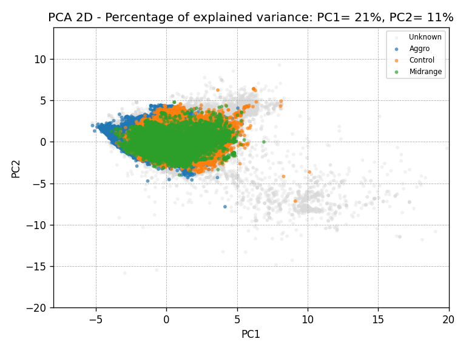

# TCG ML Tools

Overview (ML‑focused; scrapers/DB are showcase only)

- Preprocessing (shared):
  - Features: numeric CMC curve and color counts + categorical deck traits (dominant_type, main_tribe).
  - Encoders: OneHotEncoder(handle_unknown=ignore) for categoricals; StandardScaler for numerics.
  - Dense vs sparse: force dense for models that need it (HGB, SVC, kNN, NN). Fit on train only for PyTorch.

- Scikit archetype classification (`mtg_tools/ml/archetype_classification_scikit.py`):
  - Pipelines via ColumnTransformer: LogReg, LogReg+PolynomialFeatures(2), RandomForest, HistGradientBoosting, SVC‑RBF.
  - Stratified 5‑fold CV on train (macro‑F1), select best, evaluate on 20% test.
  - Saves class balance, confusion matrix, and feature importances/coefficients; persists the best pipeline.

- PyTorch archetype classification (`mtg_tools/ml/archetype_classification_pytorch.py`):
  - Dense OHE + scaled numerics → MLPs: 64→32, 128→64, 128→64→32.
  - Optimizers tried: Adam and SGD+momentum; early stopping on validation macro‑F1.
  - Outputs confusion matrix and classification report for the test split.

- PCA dimensional analysis (`mtg_tools/ml/pca.py`):
  - Dense OHE + scale, Scree plot for explained variance.
  - 2D PCA scatter (with labeled/unknown points) and top‑feature contribution bars for PC1/PC2.

- K‑Means clustering (`mtg_tools/ml/kmeans.py`):
  - Dense OHE + scale, K in [2,15] with elbow and silhouette curves.
  - Final visuals: PCA 2D cluster overlay and cluster feature heatmap; prints cluster composition, purity, entropy.
  - Example full runs include K=8, 10, 13.

- Winrate regression (synthetic target) (`mtg_tools/ml/winrate_regression.py`):
  - Programmatically synthesizes wins/losses/wr with feature‑driven signal + noise for demonstration.
  - Models: Ridge, Polynomial Ridge(2 on numerics), kNN(11, distance weights); 5‑fold CV (R²) then test R²/MAE/RMSE.
  - Saves CV bars, predicted‑vs‑true scatter, and top coefficients plot for the best ridge variant.

Note: The database build and scrapers are included to showcase engineering, but ML scripts are the reproducible core (a demo DB is provided; full DB is optional).

TCG ML Tools is a Python toolkit for analyzing Magic: The Gathering (MTG) decks end‑to‑end:

-   Scrapers to collect decklists from the web
-   A normalized SQLite database with deck, card, and feature tables
-   Preprocessing utilities to derive deck statistics and labels
-   Machine learning pipelines for classification, clustering, dimensionality reduction, and regression

This repo demonstrates applied data engineering and ML on a real dataset (demo DB included; full DB optional).

## Repository Structure

-   `mtg_tools/db/` – schema, initializers, populators, and a demo database (`mtgcore_demo.db`)
-   `mtg_tools/preprocess/` – utilities to compute deck properties and cleanse data
-   `mtg_tools/scraper/` – headless Selenium scrapers to gather deck links and data
-   `mtg_tools/ml/` – ML notebooks-as-scripts for:
    -   Archetype classification (scikit-learn and PyTorch)
    -   PCA (feature analysis and visualization)
    -   K‑Means clustering (with PCA overlays and heatmaps)
    -   Winrate regression (synthetic target for methodology illustration)
-   `mtg_tools/ml/results/` – saved figures and logs for demo and full runs
-   `docs/` – schema notes, milestones, and legal considerations

## Quick Start

Prereqs:

-   Python 3.10+ (tested with 3.12)
-   Windows, macOS, or Linux

Install dependencies (typical set):

```bash
pip install numpy pandas matplotlib seaborn scikit-learn torch torchvision torchaudio \
            selenium webdriver-manager beautifulsoup4 python-dotenv joblib
```

Environment variables for scrapers:

-   The site URLs for the scraping are not included.

### Databases

-   Demo: `mtg_tools/db/mtgcore_demo.db` (small, around 1000 decklists, included) - good for quick runs and reproducing the demo images.
-   Full: `mtgcore.db` (large, more than 600k decklists, not included) - only results for this database are included.

## Running The ML Scripts

From the repo root, you can run any script directly, e.g.:

```bash
python mtg_tools/ml/archetype_classification_scikit.py
python mtg_tools/ml/archetype_classification_pytorch.py
python mtg_tools/ml/pca.py
python mtg_tools/ml/kmeans.py
python mtg_tools/ml/winrate_regression.py
```

Each script saves figures in the parent directory. They have later been moved to `mtg_tools/ml/results/` for organisation.

## Key Results (Full DB)

Archetype buckets: Aggro, Midrange, Control. Features combine deck CMC curve, average CMC, color counts, and coarse categorical descriptors (dominant type, main tribe).

-   Scikit‑learn archetype classification (best: RandomForest)
    -   CV macro‑F1 ~0.936; test macro‑F1 ~0.939; test accuracy ~0.959
    -   Strong precision/recall across classes; Midrange is the hardest
    -   Top features align with color mix and CMC curve
-   PyTorch tabular NN classifiers (several depths; Adam and SGD)
    -   Best test macro‑F1 ~0.916 (128‑64‑32), accuracy ~0.945
    -   Close to tree models but slightly behind on macro‑F1
-   PCA (2D) shows clear class separation along a few principal axes
-   K‑Means (k=8–13) forms coherent clusters that correlate with archetype labels and CMC/color profiles
-   Winrate regression (synthetic winrates for demonstration): Poly Ridge CV R² ~0.723; test R² ~0.724

See the full write‑up with figures in `REPORT.md`.

## Selected Figures

-   Scikit (full) – Archetype classification
    -   Class balance: `mtg_tools/ml/results/scikit/archetype classification/full/class_balance_main.png`
    -   Confusion matrix: `mtg_tools/ml/results/scikit/archetype classification/full/confusion_matrix_main.png`
    -   RF importances: `mtg_tools/ml/results/scikit/archetype classification/full/rf_importances_top_main.png`


-   PyTorch (full) – Archetype classification
    -   Confusion matrix (64→32): `mtg_tools/ml/results/pytorch/archetype_classification/confusion_matrix_nn6432.png`
    -   Confusion matrix (128→64→32): `mtg_tools/ml/results/pytorch/archetype_classification/confusion_matrix_nn1286432.png`


-   PCA (full)
    -   Scree plot: `mtg_tools/ml/results/scikit/pca/full/scree_plot.png`
    -   2D scatter: `mtg_tools/ml/results/scikit/pca/full/pca_2D_scatter.png`



-   K‑Means (full, k=8)
    -   PCA overlay: `mtg_tools/ml/results/scikit/kmeans/full/8 Clusters/pca_scatter_clusters.png`
    -   Cluster heatmap: `mtg_tools/ml/results/scikit/kmeans/full/8 Clusters/clusters_features_heatmap.png`


-   Winrate Regression (full)
    -   CV R² by model: `mtg_tools/ml/results/scikit/winrate regression/full/cv_r2_bar.png`
    -   Predicted vs. true: `mtg_tools/ml/results/scikit/winrate regression/full/pred_vs_true_scatter.png`


## Notes

-   Demo vs. Full: The `mtg_tools/ml/results/scikit/*/demo` figures were generated against the demo DB; the `full` folders contain the full‑dataset results and logs.
-   Legal/Ethics: This project is intended solely for educational purposes. The websites involved do not prohibit the use of bots or web scraping according to their publicly available policies. For legal and site protection reasons, the site URLs have been omitted from the documentation.
-   License: See `LICENCE.md`.
