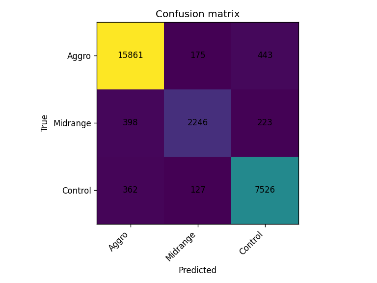
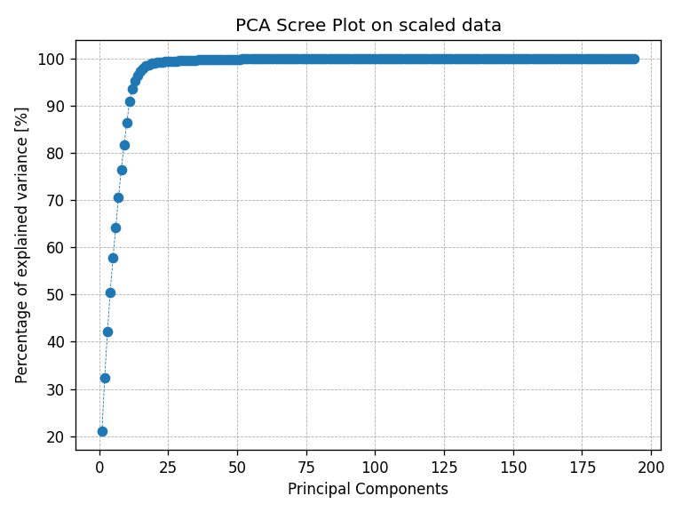
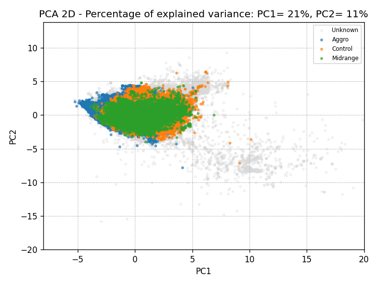
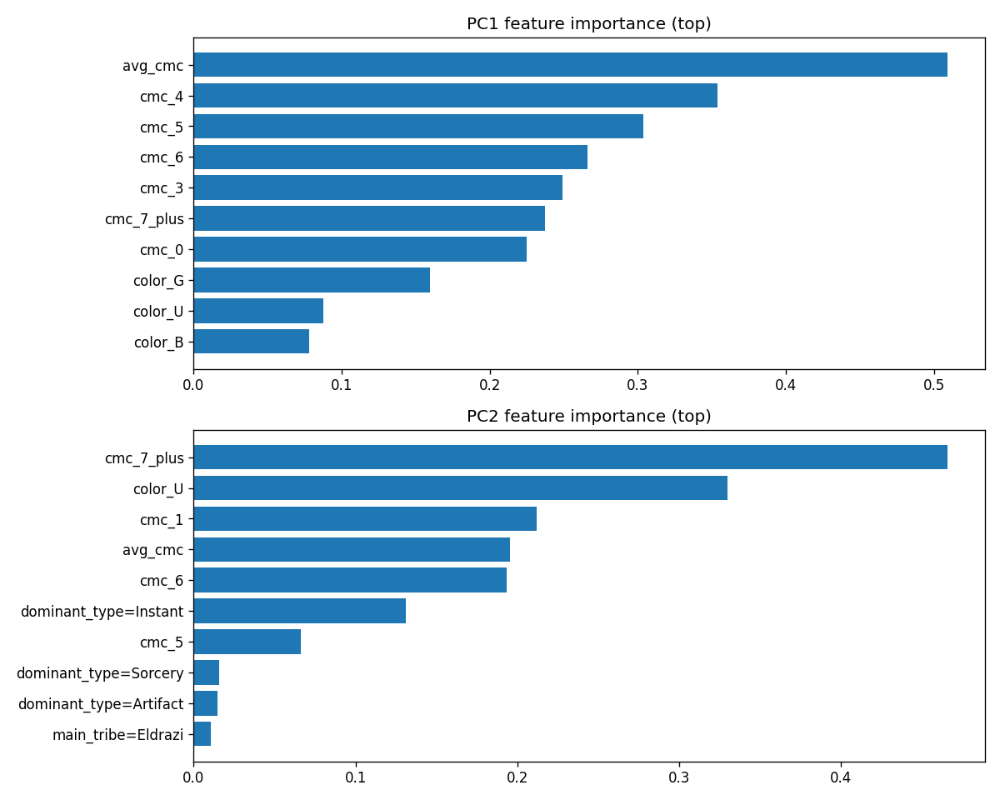

# MTG Deck Analytics – Report

This report summarizes the data pipeline and machine learning results for classifying MTG decks into broad archetype buckets (Aggro, Midrange, Control), exploring structure via PCA and K‑Means, and demonstrating a tabular regression pipeline on a synthetic win‑rate target.

All figures referenced below are committed under `mtg_tools/ml/results/` with both demo and full‑dataset runs.

## Data & Features

-   Source data is stored in SQLite (`mtgcore_demo.db` for demo; `mtgcore.db` for full).
-   Core tables used by ML live in `mtg_tools/db/schema.md`; the main feature table is `deck_stats` reinforced by coarse labels in `deck_archetypes`.
-   Label buckets: Aggro, Midrange, Control (ties resolved deterministically by source priority and tie‑break order).
-   Features:
    -   Numeric: `avg_cmc`, CMC curve counts (`cmc_0..cmc_7_plus`), color counts (`color_W..color_C`).
    -   Categorical: `dominant_type`, `main_tribe` → one‑hot encoded.

Class balance (full DB): Aggro 164,790; Control 80,153; Midrange 28,666.


## Tasks & Methods

1. Archetype classification (scikit‑learn)

-   Canonical pipelines via `ColumnTransformer` for preprocessing:
    -   Logistic Regression (with/without PolynomialFeatures on numeric branch)
    -   RandomForestClassifier
    -   HistGradientBoostingClassifier
    -   SVC (RBF)
-   5‑fold cross‑validation on the train split using macro‑F1.
-   Persist best pipeline and save plots (class balance, confusion matrix, and importances/coefficients if applicable).

2. Archetype classification (PyTorch)

-   Dense OHE + StandardScaler (fit on train only), then a feed‑forward NN.
-   Architectures explored: 64→32, 128→64, 128→64→32; optimizers: Adam and SGD+momentum.
-   Early stopping on validation macro‑F1; final report on test split with confusion matrix.

3. PCA

-   Dense OHE+scale, `PCA(n_components=2)` for visualization and a full scree plot.
-   Top feature contributors per PC are reported for interpretability.

4. K‑Means Clustering

-   Dense OHE+scale, K in [2, 15] with elbow and silhouette curves.
-   Final clustering at selected K with PCA overlay and a cluster feature heatmap.
-   Cluster summaries show size, labeled composition, purity, and entropy.

5. Win‑Rate Regression (synthetic)

-   A reproducible function synthesizes `wins`, `losses`, and `wr` using plausible signals from features.
-   Models: Ridge, Polynomial Ridge (degree 2 on numeric branch), and kNN (k=11, distance weights).
-   5‑fold CV (R²) and test metrics; plots include CV bars and predicted vs. true scatter.

## Results (Full Dataset)

### Archetype Classification – scikit‑learn

Cross‑validation (macro‑F1 on train splits):

-   RandomForest ≈ 0.936; HistGB ≈ 0.908; SVC‑RBF ≈ 0.905; LogReg+Poly ≈ 0.786; LogReg ≈ 0.622.

Held‑out test split (best = RandomForest):

-   Accuracy 0.959, Macro‑F1 0.939.
-   Per‑class highlights: Aggro F1 ≈ 0.972, Midrange F1 ≈ 0.890, Control F1 ≈ 0.955.

Confusion matrix (full):


Top RandomForest feature importances (full):


Console log (full): `mtg_tools/ml/results/scikit/archetype classification/mtgcore_classification.txt`.

### Archetype Classification – PyTorch

Representative training curve (Adam; early stopping) achieved test macro‑F1 in the 0.90–0.92 range, with the best configuration around 128→64→32 reaching:

-   Accuracy 0.945, Macro‑F1 0.916 (full), strong Aggro/Control performance, weaker on Midrange.

Confusion matrices:




Console log (full): `mtg_tools/ml/results/pytorch/archetype_classification/mtgcore_classification nn.txt`.

Notes:

-   No major over/under‑fitting symptoms were observed; deeper/wider NNs and both Adam/SGD were tried.
-   Tree‑based models still edged out NNs on macro‑F1, likely due to categorical interactions and non‑linearities captured efficiently by ensembles.
-   Also MTG is

### PCA

-   Scree plot displays rapid variance capture in the first components.
-   PCA 2D scatter shows clear separations consistent with archetype structure.





Feature analysis on PC1/PC2 highlights curve shape and average mana cost as strong drivers and color mix as a secondary.



### K‑Means Clustering

-   Elbow and silhouette curves inform reasonable K in the 8–13 range.
-   PCA overlays reveal well‑separated clusters; heatmaps show distinct CMC/color profiles.


Excerpt (k=10) – size and labeled composition:

```
cluster  size_total  size_labeled  size_unlabeled  %Aggro  %Midrange  %Control   purity  entropy
0            76684         32845           43839   0.26     0.04       0.70       0.70    1.05
1           103705         48877           54828   0.54     0.07       0.39       0.54    1.27
3            61675         34486           27189   0.80     0.05       0.15       0.80    0.89
7            60301         35081           25220   0.96     0.03       0.01       0.96    0.25
...
```

### Win‑Rate Regression (synthetic)

-   CV (R², 5‑fold): Ridge ≈ 0.556; PolyRidge ≈ 0.723; kNN ≈ 0.680.
-   Test (best = PolyRidge): R² 0.724, MAE 0.049, RMSE 0.063.


## Reproducibility & How To Run

1. Install dependencies (see repository `README.md`).
2. Run scripts from repo root:

```bash
python mtg_tools/ml/archetype_classification_scikit.py
python mtg_tools/ml/archetype_classification_pytorch.py
python mtg_tools/ml/pca.py
python mtg_tools/ml/kmeans.py
python mtg_tools/ml/winrate_regression.py
```

Figures will be saved under `mtg_tools/ml/` (they were manually moved to results for organisation).

## Conclusions
